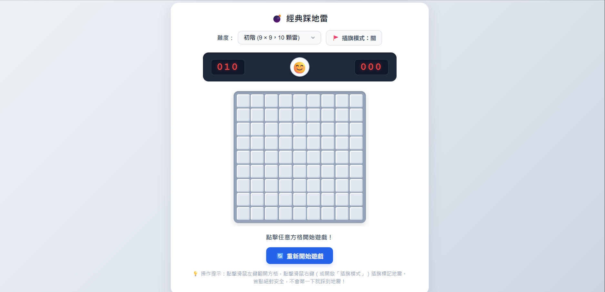

# 物聯網課程作業：個人首頁與經典踩地雷遊戲

- **學生姓名**：陳渝媗
- **作業主題**：個人資訊展示、台北即時時鐘與踩地雷網頁遊戲
- **檔案結構**：
  - `index.html`：網頁主程式（包含個人卡片、即時時鐘與踩地雷遊戲邏輯）
  - `web.png`：網頁成果截圖
  - `README.md`：專案說明與遊戲規則手冊

---

## 📷 網頁預覽

---

## 🌟 網頁功能特點

1. **個人資訊卡片**：
   - 清楚呈現學生姓名「**陳渝媗**」與作業資訊。
   - **台北即時時鐘**：透過 JavaScript `Intl.DateTimeFormat` 綁定 `Asia/Taipei`（UTC+8）時區，精準呈現西元年月日、星期與每秒動態跳動的 24 小時制時鐘。

2. **多難度選擇**：
   - 🟢 **初階**：`9 × 9` 網格，共 `10` 顆地雷（適合新手快速上手）。
   - 🟡 **中階**：`12 × 12` 網格，共 `20` 顆地雷（標準難度，具挑戰性）。
   - 🔴 **高階**：`16 × 16` 網格，共 `40` 顆地雷（考驗邏輯推理與耐力）。

3. **貼心操作與人性化機制**：
   - **首點安全保證**：第一步點擊必定為安全空格，並智慧展開周圍安全區域，絕不開局即死。
   - **空白格連鎖展開**：若點開的格子周圍 8 格皆無地雷，系統會自動遞迴展開周邊安全格。
   - **插旗模式切換鈕**：除了支援標準滑鼠右鍵插旗，亦提供「🚩 插旗模式」一鍵開關，筆電觸控板也能順暢遊玩。
   - **數位 LCD 儀表板**：即時顯示「剩餘地雷數」與「遊戲用時（秒數）」。
   - **即時重新開始**：隨時可點擊表情圖示（😊 / 😵 / 😎）或下方的「重新開始遊戲」按鈕重開新局。

---

## 💣 踩地雷遊戲規則介紹

### 1. 遊戲目標
在不踩到任何隱藏地雷的前提下，**翻開棋盤上所有非地雷的安全格子**，或將所有隱藏地雷全數正確標記出來。

### 2. 數字提示意義
當你翻開一個沒有地雷的格子時，格子上會顯示數字（1 ～ 8）：
- 數字代表**以該格子為中心的九宮格（周圍 8 個相鄰格子）中，總共隱藏了多少顆地雷**。
- 例如：數字為 `1`，代表其周圍 8 格中恰好有 1 顆地雷；若數字為 `3`，則周圍有 3 顆地雷。
- 透過相鄰格子之間的數字重疊關係，進行邏輯推理，即可找出地雷的確切位置。

### 3. 操作方式說明
| 操作項目 | 桌面滑鼠操作 | 筆電觸控板 / 無右鍵環境 |
| :--- | :--- | :--- |
| **翻開方格** | 滑鼠左鍵點擊方格 | 關閉插旗模式後，點擊方格 |
| **插旗標記 / 取消標記** | 滑鼠右鍵點擊方格 | 開啟「🚩 插旗模式」後，點擊方格 |
| **重新開始** | 點擊上方表情符號 😊 或「🔄 重新開始遊戲」按鈕 | 同左 |
| **切換難度** | 使用難度下拉選單選擇 初階 / 中階 / 高階 | 同左 |

### 4. 勝負判定
- 🏆 **獲勝（Victory）**：
  - 當所有未藏有地雷的安全格子皆被成功翻開時判定獲勝！
  - 頂部表情會轉為戴墨鏡的酷笑臉（😎），系統自動將剩餘地雷補上旗子並結算通關秒數。
- 💥 **失敗（Game Over）**：
  - 一旦點擊到藏有地雷的方格，地雷會引爆（💥）。
  - 頂部表情轉為眼花頭暈表情（😵），並翻開全盤所有隱藏地雷位置供玩家檢討復盤。

---

## 🚀 如何執行

本專案使用原生 HTML5、CSS3 與純 JavaScript 撰寫，無須安裝 Node.js 或任何後端伺服器環境：

1. 下載或複製本專案資料夾。
2. 直接雙擊開啟 [`index.html`](index.html)。
3. 使用任意現代瀏覽器（Google Chrome、Microsoft Edge、Safari 或 Firefox）即可立即遊玩與檢視作業！
